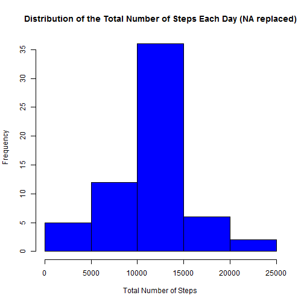

Reproducible Research - Peer Assessment 1
=========================================
    
By: Mukesh Kanchan    
        
Introduction
------------
It is now possible to collect a large amount of data about personal movement using activity monitoring devices such as a Fitbit, Nike Fuelband, or Jawbone Up. These type of devices are part of the "quantified self" movement - a group of enthusiasts who take measurements about themselves regularly to improve their health, to find patterns in their behavior, or because they are tech geeks. But these data remain under-utilized both because the raw data are hard to obtain and there is a lack of statistical methods and software for processing and interpreting the data.


Loading and Processing the data
-------------------------------

**Loading the data**

```r
# Set working directory
setwd("./data")

# Url of the data zip file
#fileURL <- "https://d396qusza40orc.cloudfront.net/repdata%2Fdata%2Factivity.zip"

# Downlaod zip file
#download.file(fileUrl, destfile='activity.zip', method='curl')

# Unzip the data file. Use read.csv() to load the data set into R
#unz("activity.zip", "activity.csv")
activity <- read.csv('activity.csv')
```

**Processing the data**

```r
# Convert date to date class
activity$date <- as.Date(activity$date, "%Y-%m-%d")

# Convert interval to numeric
activity$interval <- as.numeric(activity$interval)
```


Mean total number of steps taken per day
----------------------------------------
**Histogram of the total number of steps taken each day**

```r
# Use aggregate sum function to find the total number of steps each day
total.date.steps <- aggregate(steps ~ date, activity, sum, na.rm=T)

hist(total.date.steps$steps,
     col = "red",
     main = "Distribution of the Total Number of Steps Each Day",
     xlab = "Total Number of Steps")
```

 


**The mean and median total number of steps taken per day**

Mean total number of steps taken per day


```r
# NAs are removed already
mean(total.date.steps$steps)
```

```
## [1] 10766
```

Median total number of steps taken per day


```r
# NAs are removed already
median(total.date.steps$steps)
```

```
## [1] 10765
```

*The mean and median total number of steps per day are 10766.2 and 10765 steps respectively.*


Average daily activity pattern
------------------------------


**Time Series Plot**

```r
# aggregate steps as interval to get average number of steps in an interval across all days
total.interval.steps <- aggregate(steps ~ interval, activity, mean, na.rm=T)

# generate the line plot of the 5-minute interval (x-axis) and the average number of 
# steps taken, averaged across all days (y-axis)
plot(total.interval.steps$interval, 
     total.interval.steps$steps,
     type="l",
     main="Time Series Plot of Steps Averaged over All Days", 
     xlab="Interval", 
     ylab="Average number of steps")
```

 


**Maximun Number of Steps**

```r
# row id of maximum average number of steps in an interval
maxAveStepsRow <- which.max(total.interval.steps$steps)

# interval with maximum average number of steps in an interval
total.interval.steps[maxAveStepsRow, ]
```

```
##     interval steps
## 104      835 206.2
```

*The interval 835 contains the maximum number of steps i.e. 206.1698*


Input missing values
--------------------

**Missing Values**


```r
# only step has NA values
sum(is.na(activity$steps))
```

```
## [1] 2304
```
*Total number of missing values in dataset: 2304*


**Filling in Missing Value** 

Using the mean for the interval as a replacement for missing values.    

```r
# merge activity and tableIntervalSteps dataframes
activity.missing <- merge(activity, total.interval.steps, by = "interval", sort = FALSE)  

# rename columns
colnames(activity.missing) <- c('interval','steps','date','steps.mean')

# sort on date and interval
activity.missing <- activity.missing[with(activity.missing, order(date, interval)), ]  

# replace in steps column NA with value in mean.steps column
activity.missing$steps[is.na(activity.missing$steps)] <- activity.missing$steps.mean[is.na(activity.missing$steps)]

# remove the column with the mean since it is no longer needed
activity.missing$steps.mean <- NULL  

# data set has steps value in fraction
head(activity.missing)
```

```
##     interval   steps       date
## 1          0 1.71698 2012-10-01
## 63         5 0.33962 2012-10-01
## 128       10 0.13208 2012-10-01
## 205       15 0.15094 2012-10-01
## 264       20 0.07547 2012-10-01
## 327       25 2.09434 2012-10-01
```


**New Dataset with Filled-in Missing Values**    

Creating new dataset with rounded steps and original order of columns

```r
#rounding steps to whole number
activity.missing$steps <- round(activity.missing$steps, digits=0)

#changing order of columns
activity.new <- activity.missing[, c(2, 3, 1)]

#new dataset
head(activity.new)
```

```
##     steps       date interval
## 1       2 2012-10-01        0
## 63      0 2012-10-01        5
## 128     0 2012-10-01       10
## 205     0 2012-10-01       15
## 264     0 2012-10-01       20
## 327     2 2012-10-01       25
```


**Histogram of the total number of steps taken each day**

```r
# Use aggregate sum function to find the total number of steps each day
total.date.steps.new <- aggregate(steps ~ date, activity.new, sum, na.rm=T)

hist(total.date.steps.new$steps,
     col = "blue",
     main = "Distribution of the Total Number of Steps Each Day (NA replaced)",
     xlab = "Total Number of Steps")
```

 


**Mean and median total number of steps taken per day**

Mean total number of steps taken per day


```r
# No NAs here
mean(total.date.steps.new$steps)
```

```
## [1] 10766
```

Median total number of steps taken per day


```r
# No NAs here
median(total.date.steps.new$steps)
```

```
## [1] 10762
```

*The mean and median total number of steps per day after replacing 'NA' are 10765.6 and 10762 steps respectively.*

The Mean is equal to the estimates from the first part of the assignment.


The Median is slightly lower when compared to the first part of the assignment.


The histogram shows a similar shape as before with overall higher frequencies beacuse of the NAs were replaced in the new histogram.


Differences in activity patterns between weekdays and weekends
--------------------------------------------------------------


**Create new factor variable for weekdays**

```r
# create a factor with the names of the days for all dates
activity.new$weekdays <- factor(format(activity.new$date, "%A"))

#replace variable with weekdays and weekends
levels(activity.new$weekdays) <- list(weekday = c("Monday", "Tuesday", "Wednesday", "Thursday", "Friday"), weekend = c("Saturday", "Sunday"))
```

    
    
**Panel Plot: Average number of steps taken on weekdays and weekends**

    

```r
# aggregate steps as interval to get average number of steps in an interval across weekdays and weekends
total.interval.steps.week <- aggregate(steps ~ weekdays * interval, activity.new, mean, na.rm=T)

#plotting using lattice system
library(lattice)
xyplot(total.interval.steps.week$steps ~ total.interval.steps.week$interval | total.interval.steps.week$weekday, 
       layout = c(1, 2), 
       type = "l", 
       xlab = "Interval", 
       ylab = "Number of steps")
```


 

*------------End of Document--------------*
